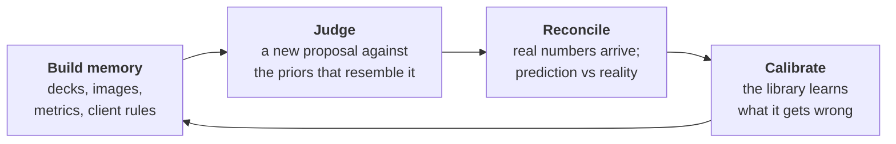
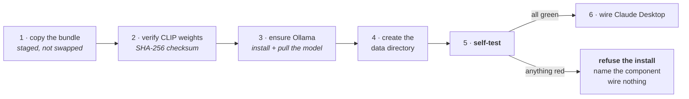

# Campaign Intelligence

**A marketing-campaign memory that Claude reasons over.** Upload your past campaigns, their
creative and their numbers. When a new brief arrives, Claude judges it against the priors that
actually resemble it — citing specific campaigns, with their real outcomes attached. After the
campaign runs, feed the numbers back and the judgment is reconciled against what happened.

> **New here?** This file covers what it is, installing it, and verifying the install.
> [`design.md`](design.md) explains the technical design.
> [`code-walkthrough.md`](code-walkthrough.md) walks the code module by module.

---

## The problem it solves

An agency runs hundreds of campaigns. The decks, the results and the client's standing rules
end up in a dozen places — someone's Drive, a wrap deck nobody reopened, a Slack thread from
eight months ago. So when a new brief lands, *"have we done this before, and how did it go?"*
gets answered from whoever happens to be in the room that day.

Three things get lost:

1. **What actually happened.** The proposal is judged against the brief, not against results,
   because the results are in a different file.
2. **What the client already told you.** "Seeding boxes go out two weeks before launch" gets
   said in three markets, is written down three times as three different rules, and never
   becomes something the next brief is checked against.
3. **What actually ran.** A campaign's numbers get read as though the brief caused them — when
   what shipped may have been quite different from what was briefed.

## What it does about that



- **Semantic search over your own history** — a proposal is matched against prior campaigns by
  meaning, not keywords, with each prior's outcome attached to it.
- **Client rules that accumulate** — the same instruction said in three markets becomes one
  standing rule that later briefs are checked against, with provenance so a judgment can cite
  where it came from.
- **Creative comparison** — what was briefed vs what the delivered photographs actually show,
  plus reuse detection across campaigns and regions.
- **Calibration** — how often the judgments have been right, and refusing to report a figure
  that is really "about whoever bothered".
- **An honest account of what is missing** — every judgment says what it rests on, and the
  library says what it does not have and what would fix it.

## The commitment that shapes everything

**Python owns the facts. Claude owns the judgment.**

The server retrieves, counts and measures. It never decides whether a campaign was good. And it
is built so it cannot make a confident claim it has nothing behind — a check that could not run
says *"not checked"*, never *"passed"*; a retrieval that found nothing says so rather than
returning the best of nothing. Every claim it emits is labelled `computed`, `judged`, `stated`
or `heuristic`, so you always know what kind of thing you are reading.

## Stack — local and free

| Concern | Choice |
|---|---|
| Database + **vector search** | SQLite + **`sqlite-vec`** (real KNN; pure-Python cosine fallback if the extension is absent) |
| File processing | `pypdf` (PDF), `python-pptx` (PPTX) |
| Text embeddings | **Ollama** `nomic-embed-text` — local, free, default. `voyage` (paid) and `hash` (offline testing only) are drop-ins |
| Image embeddings | **CLIP** ViT-B-32, shipped with the installer |
| Reasoning | **Claude** — the part you are paying for |
| Transport | MCP over **stdio** (Claude Desktop) or **Streamable HTTP** `/mcp` (Claude Web) |

No Postgres, no Docker. **Nothing leaves your machine** — Ollama runs locally, the CLIP
checkpoint ships inside the installer, and the product works on a fully air-gapped machine.

---

# Installation

Three ways in. Pick one:

| | Who it is for | Needs Python? |
|---|---|---|
| **[Prebuilt installer](#a-prebuilt-installers-recommended)** | anyone who just wants it working | no |
| **[From source](#b-from-source)** | developers | yes, 3.12+ |
| **[Offline / air-gapped](#c-offline--restricted-networks)** | locked-down corporate networks | either |

Downloads: **[Releases](https://github.com/nilubhatt/campaign-poc/releases)**.

---

## A. Prebuilt installers (recommended)

### What every installer does, in this order

The order matters and is the same on all three platforms:



**Step 5 blocks.** If any component is not working, the install fails, tells you which one, and
leaves Claude Desktop untouched — rather than reporting success over a product whose visual
search is dead, which is the failure this was built to stop.

**Step 1 stages.** On Linux and macOS the new copy is written alongside the old one and only
swapped in once the self-test passes, so a failed upgrade leaves your working install intact.

### What gets installed, and where

| | Linux | macOS | Windows |
|---|---|---|---|
| Program | `~/.local/share/campaign-intelligence` | `~/Library/Application Support/CampaignIntelligence` | `%LOCALAPPDATA%\Programs\CampaignIntelligence` |
| Data + database | `~/campaign-poc-data/` | `~/campaign-poc-data/` | `%LOCALAPPDATA%\CampaignIntelligence\` |
| Claude Desktop config | `~/.config/Claude/claude_desktop_config.json` | `~/Library/Application Support/Claude/claude_desktop_config.json` | `%APPDATA%\Claude\claude_desktop_config.json` |
| Ollama | `/usr/local/bin/ollama` | `/Applications/Ollama.app` | `%LOCALAPPDATA%\Programs\Ollama` |
| Ollama's model | `~/.ollama/models` (~274 MB) | `~/.ollama/models` | `%USERPROFILE%\.ollama\models` |

No administrator rights are needed for the product itself. Ollama's own installer may ask.

---

### macOS

**Download `CampaignIntelligence.pkg` and double-click it.** Choose **Install for me only** —
the product is per-user and needs no administrator password.

<details>
<summary><b>You will see "unidentified developer" — this is expected</b></summary>

The package is not signed yet (an Apple Developer ID is pending). macOS 15 and later refuse it
outright with no "open anyway" button. Three steps:

1. **System Settings → Privacy & Security**
2. scroll to **Security** — *"CampaignIntelligence.pkg was blocked"* — click **Open Anyway**
3. open the package again and confirm

This is not a sign the download is corrupt. When signing lands, this section goes away.
</details>

Prefer a terminal? The `.tar.gz` carries the same installer:

```bash
tar xzf campaign-intelligence-macos-arm64.tar.gz
cd campaign-intelligence
./install.sh                 # --no-ollama to skip the Ollama step
```

If the self-test fails, the full output is at
`~/Library/Logs/CampaignIntelligence-install.log`.

---

### Linux

```bash
tar xzf campaign-intelligence-linux-x86_64.tar.gz
cd campaign-intelligence
./install.sh
```

| Flag | Effect |
|---|---|
| `--no-ollama` | skip installing Ollama and pulling the model (use if you already have it) |
| `--service` | also run the HTTP server at login, via `systemd --user` |

With `--service`:

```bash
systemctl --user status campaign-intelligence
```

---

### Windows

Run **`CampaignIntelligence-Setup.exe`**. Three checkboxes:

| Task | Default | What it does |
|---|---|---|
| **Install Ollama and download the embedding model** | ✅ on | downloads and silently installs Ollama, then pulls `nomic-embed-text` (~274 MB) |
| **Connect Claude Desktop automatically** | ✅ on | writes the stdio connector into `claude_desktop_config.json` |
| **Run the server in the background at logon** | ⬜ off | a scheduled task running `serve` |

The download step can take several minutes and the installer says so while it runs. Uninstall
from **Settings → Apps**; it removes the scheduled task and the Claude Desktop entry.

---

## B. From source

Python **3.12+**.

```bash
git clone https://github.com/nilubhatt/campaign-poc.git
cd campaign-poc
python3 -m venv .venv && . .venv/bin/activate      # Windows: .venv\Scripts\activate
pip install -r requirements.txt

# the text embedder — local and free
# install Ollama from https://ollama.com, then:
ollama pull nomic-embed-text

# CLIP weights: a source checkout has no bundled copy.
# Either fetch them once (recommended) …
python scripts/fetch_weights.py models
# … or let the product resolve them from huggingface.co on first use.

python main.py health-check        # everything green?
python main.py stdio               # for Claude Desktop
python main.py serve               # or HTTP on :8086
```

Convenience wrappers exist: `./run.sh --setup` (Linux/macOS, see **[LINUX.md](LINUX.md)**) and
`run.ps1 -Setup` (Windows, see **[WINDOWS.md](WINDOWS.md)**).

---

## C. Offline / restricted networks

The product itself needs **no network**: the weights ship in the archive and the installers
verify them by checksum. CI proves this on all three platforms by running the packaged binary's
full health check — including loading the vision model, the step that would reach for the Hub —
inside an empty network namespace on Linux and with every HTTP request routed to a closed port
on macOS and Windows.

Two things do want the internet, once:

| | Why | How to avoid it |
|---|---|---|
| Ollama's installer | to install Ollama and pull the model | install Ollama out of band, then `--no-ollama` / untick the task |
| CLIP weights **in a source checkout only** | no bundled copy | `python scripts/fetch_weights.py models`, or point at a file (below) |

Resolving the model by tag goes to **huggingface.co**, which plenty of corporate networks block
outright — often with endpoint filters answering :443 in plaintext, so it fails as a TLS error
rather than an obvious block. Installed copies never do this. To supply the file yourself:

```jsonc
// claude_desktop_config.json — the env block is how a local server gets settings
"env": { "CAMPAIGN_POC_CLIP_WEIGHTS_PATH": "C:\\path\\where\\you\\put\\the\\weights" }
```

Point at the checkpoint (`open_clip_model.safetensors` or `open_clip_pytorch_model.bin`) or the
folder containing it. `CLIP_WEIGHTS_PATH` works too; the prefixed name wins if both are set.
Verified to make **zero** network calls, producing vectors identical to the tag-resolved model.

**Missing weights are never fatal.** The server still starts; text search, upload and evaluation
all work — only visual similarity is off, and it says so rather than failing quietly.

---

# Verifying the install

Run this first. It checks every component and exits non-zero if anything is wrong:

```bash
campaign-intelligence health-check
```

A healthy install looks like this — five components, each named, each either `ok` or not:

```
ok   database: 12 records in ~/campaign-poc-data/campaigns.db; vector_index=sqlite-vec
ok   computed_facts: 12 of 12 records have their facts stored, computed under rulebook core-1.0.
ok   text_search: ollama responded in 0.06s (nomic-embed-text)
ok   visual_search: weights from bundle
ok   rulebook: core-1.0: 14 rule(s). Product: .../rulebook.yaml
      12 campaigns, 40 images; 0 sections and 0 images not yet searchable
```

`--json` gives the same report for a script. `--wait 60` retries while the *only* thing wrong
is a service still starting.

### Checking each piece by hand

<details open>
<summary><b>1 · Ollama is running</b></summary>

```bash
curl http://localhost:11434/api/tags
```

Expect JSON listing your models. Connection refused means Ollama is not running:

| | |
|---|---|
| macOS | open Ollama from Applications, or `ollama serve` |
| Linux | `systemctl --user start ollama` or `ollama serve` |
| Windows | it runs at login; otherwise start Ollama from the Start menu |
</details>

<details open>
<summary><b>2 · The embedding model is actually pulled</b></summary>

This is the one people miss. **A running Ollama with nothing pulled answers on the socket and
404s every embed** — so the daemon looks healthy while text search is dead.

```bash
ollama list                     # nomic-embed-text should be listed
ollama pull nomic-embed-text    # if it is not
```

Prove it embeds:

```bash
curl http://localhost:11434/api/embeddings \
  -d '{"model":"nomic-embed-text","prompt":"a store opening in Bogota"}'
```

Expect a long array of floats. `health-check` reports this as `text_search`, and separates
*"not reachable"* from *"the model is not installed"* because they need different fixes.
</details>

<details open>
<summary><b>3 · The CLIP weights resolved</b></summary>

```bash
campaign-intelligence check-weights     # exit 1 if they did not resolve
```

An installed copy finds them beside the executable in `<install dir>/models/`. Expect
`open_clip_model.safetensors`, **302,588,458 bytes**.
</details>

<details>
<summary><b>4 · Real vector search, not the fallback</b></summary>

`health-check`'s database line says `vector_index=sqlite-vec` (real KNN) or
`python-cosine-fallback` (correct, but slower on a large library). Both work; only the speed
differs, and it is reported rather than left for you to discover with a stopwatch.
</details>

<details>
<summary><b>5 · Claude Desktop is wired</b></summary>

```bash
# macOS
cat ~/Library/Application\ Support/Claude/claude_desktop_config.json
# Linux
cat ~/.config/Claude/claude_desktop_config.json
# Windows (PowerShell)
type $env:APPDATA\Claude\claude_desktop_config.json
```

Expect a `campaign-intelligence` entry whose `args` are `["stdio"]`. Then **fully quit Claude
Desktop** — ⌘Q or File → Exit; closing the window is not enough — and reopen it. Ask it
*"what campaigns do you have on file?"* and it should call `list_campaigns`.

Not wired, or you skipped it?

```bash
campaign-intelligence configure-desktop
```
</details>

<details>
<summary><b>6 · End to end</b></summary>

In Claude Desktop:

1. *"Upload this as a concluded campaign in Peru"* + attach a deck → `upload_campaign`
2. *"Add its results: ROAS 3.4"* → `add_metrics`
3. *"What's missing from my library?"* → `gaps`
4. *"Judge this new proposal against our history"* → `prepare_evaluation` → `save_evaluation`
</details>

---

## Troubleshooting

| Symptom | Cause | Fix |
|---|---|---|
| Install refused, names a component | the self-test blocked it — working as designed | fix what it named, re-run the installer |
| `text_search` fails, Ollama is running | model never pulled | `ollama pull nomic-embed-text` |
| `visual_search` unavailable | weights missing or corrupt | `check-weights`; reinstall, or set `CAMPAIGN_POC_CLIP_WEIGHTS_PATH` |
| Claude does not see the tools | host cached the old schemas | **fully quit** and reopen the host app |
| A parameter "does not exist" but should | same cause | `health_check` lists every tool's real parameters |
| Records stored but searches find nothing | indexing stopped at the time budget | `finish_indexing` |
| Slow on a big library | pure-Python vector fallback | check the `database` line; `sqlite-vec` needs the extension to load |
| macOS: "unidentified developer" | package not signed yet | System Settings → Privacy & Security → Open Anyway |

### After rebuilding: fully quit the host app

An MCP host caches each tool's schema when it connects. Rebuild the server mid-session and the
client keeps the old schemas — parameters that are live and working simply are not there, with
no error to say so. This cost a reviewer an afternoon of rediscovering five parameters by trial
and error against a server that already supported all of them.

`health_check` returns `version`, `build`, and a `tools` map of every tool to its real parameter
list, read off the functions themselves — so the gap is named rather than guessed at.
`campaign-intelligence --version` answers the same question from a terminal, and works on a
machine where the database, the model and the embedder are all broken.

---

# Connecting Claude Web / cowork

Claude Desktop is wired by the installer. For Claude Web you need the HTTP transport on a
reachable HTTPS URL:

```bash
campaign-intelligence serve                       # http://0.0.0.0:8086
curl http://localhost:8086/healthz                # {"status":"ok","vector_backend":"sqlite-vec",…}

cloudflared tunnel --url http://localhost:8086    # or: ngrok http 8086
```

Then **Claude Web → Settings → Connectors → Add custom connector** → `<public-url>/mcp`.

> **Attaching a file in chat is not the same as sending the file.** Claude reads the deck and
> passes the text, so the server never sees the bytes — and comments, speaker notes and embedded
> images can only be read from the file itself. To capture those, `POST` it to `/upload`, or use
> Claude Desktop where a local path can be passed as `asset_ref`. The upload result says which
> happened: `commentary_checked: false` means nothing was read, not that the deck had no
> comments.

> **Auth** is a no-op seam today (`CAMPAIGN_POC_AUTH_MODE=none`). claude.ai connectors generally
> want OAuth — implement `auth.authenticate()` and set the mode to `oauth`.

---

## Weights provenance — verify rather than trust

The shipped checkpoint is vendored in this repo's
[`weights-v1`](https://github.com/nilubhatt/campaign-poc/releases/tag/weights-v1) release,
because the networks this product targets block huggingface.co. You should not have to take
that file on trust:

| | |
|---|---|
| shipped (fp16) | `cbd90e47b939016c1cb2e3dc63e3d5ee3d663da57dc929c6ebb3067eedd0c452` · 302,588,458 bytes |
| upstream (fp32) | `e6d1bd7789aa45192b3bf90570a789b478bae1b74ebcce7eddd908e83a2b7c31` · 605,143,284 bytes |
| upstream source | `timm/vit_base_patch32_clip_224.openai` @ `a6f597a30f7b82c51704746581f9a4e41421e878` |

The conversion is deterministic, so you can rebuild the exact bytes:

```bash
python scripts/convert_fp16.py upstream_fp32.safetensors rebuilt.safetensors
shasum -a 256 rebuilt.safetensors   # matches the fp16 hash above
```

CI does this on every change to the weights tooling and fails if the rebuild stops matching,
then attaches build provenance — so
`gh attestation verify open_clip_model.safetensors --repo nilubhatt/campaign-poc` confirms the
bytes came from that workflow rather than from someone's laptop.

---

## Your own rules

The product ships **generic**: no rules, no vocabulary, no scorecard. What belongs in a
rulebook is a rule about *your* briefs, which nothing else in the product knows — so you write
one, and it layers over the product's:

```bash
campaign-intelligence init                      # prints the data directory
cp example-rulebook.yaml "<data dir>/rulebook.yaml"   # a worked example of every shape
# edit it, then restart the server
```

`health-check` then reports the rulebook as `core-1.0+your-version`, naming both.

Two files ship beside the binary.

`fabletics-rulebook.yaml` is a real customer rulebook — four non-negotiable guardrails, a tag
taxonomy, influencer criteria and red flags, recurring partner feedback, a 360° launch
checklist, a six-criteria scorecard and ten standing corrections with their provenance. **This
build installs it for you**: `init` copies it into the data directory on a fresh install, so a
new machine has the rules without anybody remembering to. An existing rulebook is never
overwritten — yours is yours — and a build that does not ship the file installs nothing and
stays generic.

`example-rulebook.yaml` is a worked example using an invented agency: every shape the file can
carry, nothing in force. Start from it if you are writing your own.

## Configuration

Every knob is an environment variable. The ones worth knowing:

| Variable | Default | What it does |
|---|---|---|
| `CAMPAIGN_POC_DATA` | `~/campaign-poc-data` | data directory |
| `CAMPAIGN_POC_DB` | `<data>/campaigns.db` | database file |
| `CAMPAIGN_POC_EMBED_PROVIDER` | `ollama` | `ollama` · `voyage` · `hash` |
| `CAMPAIGN_POC_OLLAMA_MODEL` | `nomic-embed-text` | embedding model |
| `CAMPAIGN_POC_CLIP_WEIGHTS_PATH` | — | supply CLIP weights yourself |
| `CAMPAIGN_POC_TOOL_BUDGET_SECONDS` | `45` | ceiling on one tool call |
| `CAMPAIGN_POC_PORT` | `8086` | HTTP port |

`hash` is for offline pipeline testing only — it has **no semantics** and scores a paraphrase
and an unrelated pair identically.

---

## Uninstalling

| | |
|---|---|
| Linux / macOS | `./uninstall.sh` from the install directory |
| Windows | Settings → Apps → Campaign Intelligence |

All three remove the Claude Desktop entry. **Your data directory is left alone** — delete it
yourself if you want it gone: `~/campaign-poc-data` on Linux and macOS,
`%LOCALAPPDATA%\CampaignIntelligence` on Windows.

To see what the product holds about people, and remove it:

```bash
campaign-intelligence disclosure
```

---

## Tools (what Claude calls)

All 65 of them. Claude picks the tool; you speak English.

| Area | Tools |
|---|---|
| Records | `attach_deck` · `delete_campaign` · `get_campaign` · `list_campaigns` · `update_campaign` · `upload_campaign` |
| Creative | `check_image_provenance` · `compare_execution` · `find_similar_images` · `update_asset` · `upload_image_asset` · `upload_image_assets` |
| Outcomes | `add_metrics` · `bulk_import_metrics` · `graduate_measure` · `measure_status` · `resolve_measure` |
| Judgment | `answer_finding` · `diff_campaigns` · `find_similar_campaigns` · `get_evaluation` · `list_evaluations` · `prepare_evaluation` · `save_evaluation` |
| Reconciliation | `calibration` · `get_reconciliation` · `link_evaluation` · `reconcile_evaluation` · `save_reconciliation` |
| Client rules | `correction_status` · `graduate_correction` · `keep_correction` · `list_corrections` · `load_rulebook_corrections` · `note_correction` · `reopen_correction` · `replay_rules` · `resolve_correction` · `set_aside_correction` |
| Commitments | `add_commitment` · `check_commitments` · `drop_commitment` · `list_commitments` |
| Context & drift | `attribute_outcome` · `campaign_context` · `classify_drift` · `drift_readings` · `record_context_event` · `withdraw_attribution` · `withdraw_context_event` |
| The library | `answer_gap` · `answers` · `coverage` · `finish_indexing` · `gaps` · `getting_started` · `health_check` |
| People | `backfill_author_unknown` · `correct_person_name` · `person_on_file` · `personal_data_position` · `pseudonymise_person` |
| Feedback | `feedback_choose` · `feedback_queue` · `feedback_record` |

## For developers

- [`design.md`](design.md) — architecture, data model, the pipelines, the design rules
- [`code-walkthrough.md`](code-walkthrough.md) — every module, what it does, where to look
- `docs/PRODUCT-REVIEW-PLAN.md` — the full phased history, item by item
- `docs/DEFERRALS.md` — every deferred decision and why

```bash
python -m pytest -q          # ~2,600 tests, about 4 minutes
```

## Roadmap

Being extended into the full product — a central multi-user server (Postgres + pgvector,
region-scoped metadata, pluggable OAuth). Server-side chunking already ships locally; the
central move swaps the vector store for pgvector with the same chunking. `vectorstore.py` is the
single swap point. See **[docs/PRODUCTION-ROADMAP.md](docs/PRODUCTION-ROADMAP.md)**.

## Status

End-to-end verified against a live server with the real `sqlite-vec` backend: the full
memory → judge → reconcile loop over MCP, plus `/upload` → ingest-by-`asset_id` with server-side
PPTX/PDF extraction.

Not built yet, deliberately: OAuth, multi-user isolation, retention policy, and the Postgres
migration.
