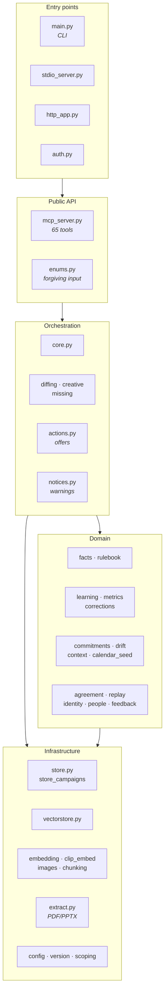

# Campaign Intelligence — Code Walkthrough

> **Who this is for.** Somebody about to change this code. Read
> [`design.md`](design.md) first for *why* it is shaped this way; this document is *where
> everything is*. [`README.md`](README.md) covers installing and running it.

**37 modules of product code and 106 test files — more lines of test than of product.** The test-to-code ratio is not an accident: almost every rule described below is
pinned by a test that was written to fail first.

---

## Map of the codebase



---

## 1. Entry points

### `main.py` — the packaged binary's front door

One `argparse` dispatcher. Every subcommand exists because somebody needed it on a machine
where something was broken.

| Command | What it does |
|---|---|
| `serve` | HTTP server (`/mcp`, `/upload`, `/healthz`) |
| `stdio` | **the path the installers wire into Claude Desktop** |
| `init` | create the data directory and database; idempotent |
| `health-check` | check every component; exit 1 if anything is wrong. `--json`, `--wait N` |
| `check-weights` | did the CLIP checkpoint resolve? |
| `configure-desktop` | merge this server into Claude Desktop's config (backs up first) |
| `unconfigure-desktop` | remove it again (used by uninstallers) |
| `disclosure` | what this product stores about people, where, for how long |
| `--version` | touches no database, no embedder, no model — the first thing support asks |

**Read the `stdio` branch.** It warms CLIP and the text embedder *before* serving, because the
frozen binary originally did not, and every installed copy paid a 60-second model load inside
the first image tool call — the transport timeout the product review opened with.

### `stdio_server.py` and `http_app.py`

Two transports, one tool surface. `http_app` takes MCPServer's own Streamable HTTP app and
bolts on `POST /upload` (a side channel for files too big for a tool argument, returns an
`asset_id`) and `GET /healthz` (liveness plus which backends are live).

### `auth.py`

Pluggable auth for the HTTP surface. Off by default for local use; the seam exists so the
hosted version does not need a different server.

---

## 2. The public API

### `mcp_server.py` — 65 tools

Every tool is a typed Python function with a docstring Claude reads. This file contains **no
business logic** — each tool validates, normalises, calls `core`, and returns. The rule is
deliberate: logic here would be logic the CLI and the HTTP surface cannot reach.

Tools by area:

| Area | Tools |
|---|---|
| Records | `upload_campaign` `update_campaign` `delete_campaign` `attach_deck` `list_campaigns` `get_campaign` |
| Creative | `upload_image_asset(s)` `update_asset` `find_similar_images` `check_image_provenance` `compare_execution` |
| Outcomes | `add_metrics` `bulk_import_metrics` `resolve_measure` `graduate_measure` `measure_status` |
| Judgment | `prepare_evaluation` `save_evaluation` `get_evaluation` `list_evaluations` `diff_campaigns` `find_similar_campaigns` |
| Reconciliation | `reconcile_evaluation` `save_reconciliation` `get_reconciliation` `link_evaluation` `calibration` |
| Client rules | `note_correction` `list_corrections` `resolve_correction` `set_aside_correction` `reopen_correction` `keep_correction` `correction_status` `graduate_correction` `load_rulebook_corrections` |
| Commitments | `add_commitment` `list_commitments` `drop_commitment` `check_commitments` |
| Context | `record_context_event` `campaign_context` `attribute_outcome` `withdraw_attribution` `withdraw_context_event` `classify_drift` `drift_readings` |
| The library | `health_check` `finish_indexing` `coverage` `gaps` `answers` `answer_gap` `answer_finding` `getting_started` `replay_rules` |
| People | `person_on_file` `pseudonymise_person` `correct_person_name` `personal_data_position` `backfill_author_unknown` |
| Feedback | `feedback_queue` `feedback_choose` `feedback_record` |

`_catch_value_errors` is the one piece of machinery: a `ValueError` raised anywhere below
becomes a readable message rather than "Error executing tool" with the reason discarded.

### `enums.py` — forgiving input, teaching errors

Three layers, because they are three different claims:

1. **Shape** — case, spacing and punctuation are not meaning, so `"In Flight"`, `"in-flight"`
   and `"in_flight"` are one value.
2. **Synonyms** — an explicit table a human can read and argue with: `"client stated" → stated`,
   `"live" → in_flight`, `"done" → concluded`.
3. **Teach** — always return the valid set; suggest the closest match *only* when something
   really is close.

Two synonyms were deliberately **removed** and the reasoning is worth reading in the file:
`past → concluded` is temporal not lifecycle (a *cancelled* campaign is also past), and
`confirmed → verified` collides with the hard meaning `verified` carries here (backed by a real
measured metric).

Normalisation happens identically on the **filter** side — a value the library accepted that
cannot then be used to search for itself is a trap rather than a kindness.

---

## 3. Orchestration

### `core.py` — the biggest file, and where the work happens

Navigate it by its section markers:

| Section | Where | Contains |
|---|---|---|
| **ingest** | `core.py` | `ingest_campaign`, `attach_deck`, `update_campaign`, the two-pass index rebuild |
| **retrieval / evidence** | `core.py` | `find_similar`, `prepare_evaluation`, `save_evaluation`, the stamp |
| **coverage** | `core.py` | `coverage`, `readiness`, `library_state` |
| **the first run** | `core.py` | `getting_started`, `first_steps` |
| **what is missing** | `missing.py` | `gaps`, the eight gap codes, ranking, offers |
| **answering back** | `missing.py` | `answer_gap`, `answer_finding`, set-aside and reopening |
| **comparing briefs** | `diffing.py` | `diff_campaigns` |
| **image assets** | `creative.py` | `ingest_image_asset`, `find_similar_images`, pHash reuse detection |
| **what shipped** | `creative.py` | `compare_execution`, execution drift |

Everything in the right-hand modules is **re-exported from `core`**, so `core.diff_campaigns`
and `core._snapshot_execution_drift` are what callers and tests still say. Two things to know
before moving anything else:

- A re-export is a **separate binding**. `monkeypatch.setattr(core, "f", ...)` does not change
  what a function inside `diffing`/`creative`/`missing` calls. Only `core.health_check_cli` is
  patched that way today, and it stayed in `core.py`.
- The split modules import `core` **inside** the functions that need it, because `core` imports
  them at module level and an import back would be a cycle.

Functions worth knowing by name:

- **`library_state()`** — the single definition of "measured", "has a verdict", "ran". Several
  surfaces used to compute these separately and contradict each other.
- **`_add_vector()`** — writes a vector *and* its model together. One function, so the two
  cannot drift.
- **`health_check()` / `health_check_cli()`** — the latter opens the database **read-only**,
  because a diagnostic must not repair what it is diagnosing. The normal path once created a
  fresh database when the real one was missing and reported "0 records, healthy".
- **`finish_indexing()`** — closes whatever a time budget left undone. Resumable, and says so
  *only* when continuing would actually help: an embedder that is down fails every item
  instantly, and advising "call again" there invites a loop against a component that is not
  coming back.
- **`gaps()`** — opens one read scope for the whole report so the same record is not re-read
  by each part.

### `actions.py` — what to offer next

An **offer** is a prefilled tool call the user can accept in one step. `action()` drops
arguments whose value is unknown rather than sending them blank, and `needs` lists what the
user must still supply — because "accepting is one step, not a form" is only true while the
prefilled arguments are enough.

`identity()` and `trim()` de-duplicate offers. Note the comment on `identity()`: it serialises
rather than tuples, because a prefilled argument can be a list, and a tuple containing a list
is unhashable — which crashed de-duplication rather than de-duplicating.

### `notices.py` — warnings with a shape

One field per reader: `detail` (what happened), `affects` (what it costs), `remedy` (what fixes
it), `next_step` (the command). Written because the product once handed a marketer
`HTTPConnectionPool(host='localhost', port=11434)`.

---

## 4. Domain modules

### `facts.py` — the findings that need no language model

Dates, money, creator profiles, engagement rates, the 360 checklist. Regex and arithmetic over
deck text, cached per campaign and keyed on a **content hash** of the inputs plus a stamp of
the source — not on a self-declared version string, because an unbumped version leaves a stale
cache stale forever.

### `rulebook.py` — the rules every judgment is made under

A versioned YAML file with an editable overlay. `load()` is cached; `version()` stamps every
judgment; `vocabulary()` declares the tag vocabulary that comparison resolves synonyms through —
**a synonym is resolved at comparison time, never by rewriting stored data.**

### `learning.py` — one mechanism, two subjects

The gate both metric keys and client rules pass through. `gate()` counts **breadth**
(`distinct_briefs`, `subject_markets`, partners) rather than repetition; `require_a_person()`
enforces that graduation is always somebody's decision; `fold_markets()` and `reaches()` are the
*one* folded market-membership test, extracted after the same loop was found in seven places.

### `metrics.py` — the metric registry

Typed storage per key, with `canonical()`/`unit_of()` resolving what a marketer typed into what
the registry holds. `graduate()` promotes a key once it has passed the gate, recording who
decided. `retire_stale()` proposes retirement; it never retires automatically.

### `corrections.py` — standing client rules

`note()` records a mention with its provenance (**required** — a correction with no provenance
is an opinion in a text field). `_looks_like()` suggests a possible duplicate; `resolve()` takes
the three answers §8.2 allows: `same_rule`, `different_rule`, `set_aside`.

Read `negated()` and `resembles()` together: a prohibition and its permission are **not** the
same rule, however alike they read, and the guard that enforces that is deliberately crude and
used only to *refuse* a suggestion, never to make one.

### `commitments.py` — the promises a brief named

`extract()` pulls candidate promises from deck text; `check()` looks for each in the delivered
photographs via CLIP. `_NOT_ANSWERABLE` refuses anything about **how many** or **all** of
something, out loud, with the reason — because this instrument answers "does any one image look
like this", and for *"a single colourway"* four colourways in frame would make the match
stronger.

### `drift.py` — drift is not a synonym for failure

`classify()` records *why* an execution moved from its brief. A campaign that drifted and
worked is evidence that something worked and the brief may not have been it — which is a
different claim from "it failed", and the library is required to keep them apart.

### `context.py` — what else was happening

Context events scoped by market and date: a competitor launch, a holiday, a platform outage.
`campaign_context()` reports the overlap and **never the cause** — the product records that two
things coincided, and refuses to say one produced the other.

### `calendar_seed.py`

The fixed calendar shipped with the product, so "Semana Santa" is a date range the library
knows without anyone typing it.

### `replay.py` — replay as a report

`run()` re-applies today's rules to past briefs and reports what *would* have been flagged.
`if_graduated()` answers "what would change if this rule became standing" — so graduating a rule
is a decision somebody can see the consequences of first.

### `agreement.py` — the instrument

"Consistency is a number, not a feeling." Runs the same judgment repeatedly and reports
agreement, stamped with the embedder and rulebook version — two runs that agree while differing
in either agree about nothing in particular.

### `identity.py` and `people.py`

Who said it, how much that claim is worth, and what a person can do about it: `pseudonym()`,
`erase()`, `rename()`, `retention()`, and `install_disclosure()` behind the `disclosure`
command. `redact_paths()` keeps file paths — which contain names — out of what is stored.

### `feedback.py` — capturing feedback without making anyone type

A numbered queue. `queue()` lists what is waiting, `choose()` takes a number, `record()` stores
the answer. `waiting()` returns a **campaign** count, and the comment explaining why is worth
reading: a row that was not about a campaign once raised a `KeyError` into a bare `except`,
which came back as `0` and silently switched off every proactive offer in the product.

---

## 5. Infrastructure

### `store.py` + `store_campaigns.py` — SQLite, and Python owns it

All SQL lives here. Schema in `_SCHEMA`, indexes in `_INDEXES`, and migration is **additive**:
`_declared_ddl` / `_add_missing_columns` add what is missing at startup, so an existing database
upgrades in place without a migration step. Tables belong in `_SCHEMA`, never `_INDEXES` — a
table declared as an index is created but never migrated.

`store_campaigns.py` holds the campaigns table — its listing and filtering, markets and tags,
and deleting a record with everything keyed to it — and `store` re-exports all of it. What
remains in `store.py`: the base, chunks, assets, metrics, evaluations, context events,
commitments, corrections, the computed-facts cache and reconciliations.

The file's `# ──` markers are a guide and **not a grouping**: the span labelled "context events"
actually runs through commitments, corrections, the facts cache and metric helpers. Check what
is really in a span before moving it.

Four names are monkeypatched on `store` across the suite — `text_on_file`, `citations`,
`metric_registry`, `_facts_algorithm_stamp`. Because a re-export is a separate binding, a
function that moves away from one of those stops seeing the patch. That is why the campaigns
block, which contains none of them, was the one that moved first.

Helpers to know: `vector_models()` (which model made each vector, tolerating the pre-`space`
schema), `forget_vector_models()` (provenance must not outlive its vectors),
`execution_drift_for()` (`never_checked` is a **third state**, not a low score).

### `vectorstore.py` — the vector store

`SPACES` and `CLIP_SPACES` are the single lists everything else reads. `init`/`add`/`get_many`/
`search`, `backend_name()` (`sqlite-vec` or `python-cosine-fallback`), and
`count_unreadable_vectors()` — the one check that notices a vector table *this build cannot
read*, which otherwise looks exactly like a library where every row is indexed and every search
returns nothing.

### `embedding.py` and `clip_embed.py`

Text and image embedders. `embed_once()` is memoised **per call, not per process** — a
process-lifetime cache served a vector computed in an earlier call and hid an embedder that had
gone down in between.

`clip_embed` resolves weights from the bundle first, then a configured path, then the Hub;
`weights_status()` reports which, and `warm_up()` pays the model load at startup rather than
inside somebody's first tool call.

The bundled `hash` provider is for offline smoke tests **only** — it has no semantics, and
scores a paraphrase and an unrelated pair identically.

### `images.py` and `chunking.py`

Perceptual hashing for creative-reuse detection, and chunk packing at 1,800 characters. One
thing that catches people: `chunking.pack` **merges adjacent units**, so a continuation chunk
carries no section header.

### `extract.py` — PDF and PPTX

`extract_units()` (text), `extract_images()`, `extract_commentary()` (the client's own remarks,
often the most useful precedent in the deck). Bounded by config: 60 PDF pages, 120 PPTX slides,
40,000 characters, 20 images per deck.

### `config.py`, `version.py`, `scoping.py`

Every knob is env-overridable (`CAMPAIGN_POC_*`). **`config` caches paths at import** — setting
the environment variable after importing has no effect, which matters when writing tests.

`scoping.scoped_memo()` gives "one call, one set of answers" using a `ContextVar` — not a module
global, because MCP runs sync tools on worker threads via `anyio.to_thread.run_sync` and a
global is shared by overlapping calls.

---

## 6. Conventions you will be held to

**Comments carry the reasoning.** Many explain a defect that was actually shipped, and the
review history is in the file rather than only in git. If you change behaviour a comment
describes, change the comment in the same commit — a false comment ranks with a false statement
in code.

**Section references** (`§9.3`, `D126`) point into `docs/PRODUCT-REVIEW-PLAN.md` and
`docs/DEFERRALS.md`. A `D###` in code must exist in the tracker; a test enforces it.

**Tests are prose.** Each test's docstring says what failure it exists to prevent, usually with
the measurement. When adding one, write it to fail first, then make it pass, then **break the
implementation and confirm it goes red** — several tests here were found passing on comments
rather than code.

---

## 7. Running the tests

```bash
python -m pytest -q                              # everything (~4 min, 2,600+ tests)
python -m pytest tests/test_gaps.py -q           # one file
python -m pytest -q -p no:randomly               # fixed order when bisecting
```

Tests use a temp database via the `conn` fixture. **Never point them at a real data directory**:
`config` caches paths at import, so a test that sets only the environment variable will write
to the real database.

CI runs the suite on Linux, the macOS installer and packaging tests on macOS, and compiles the
Windows installer's Pascal `[Code]` section — which nothing in the Python suite can check.
