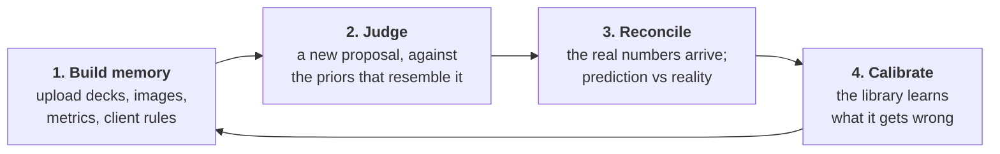
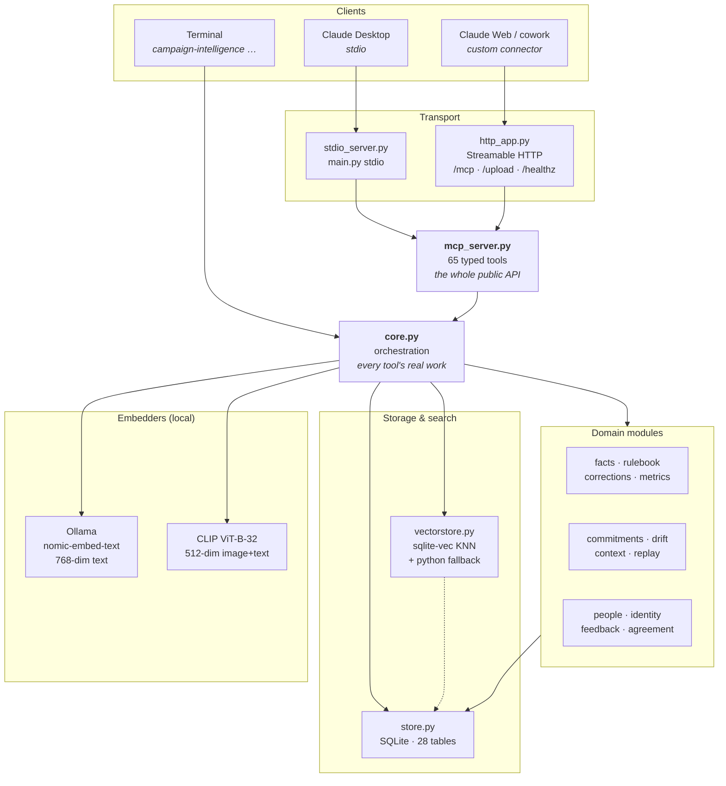
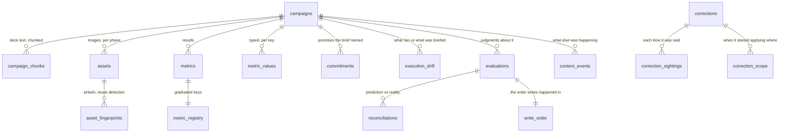
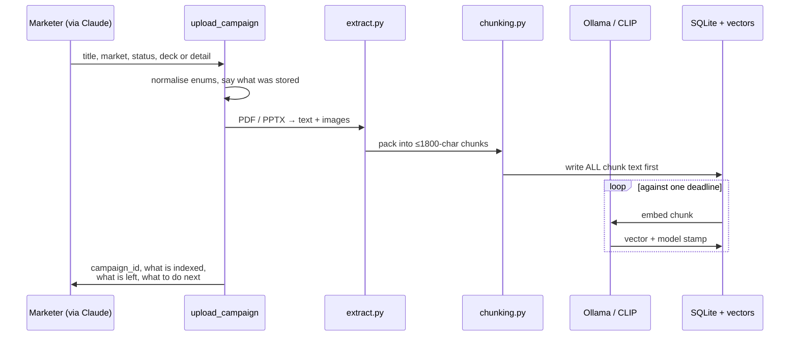
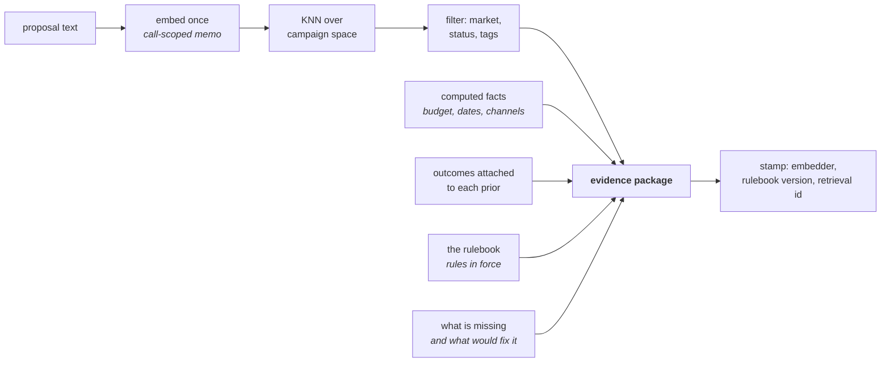
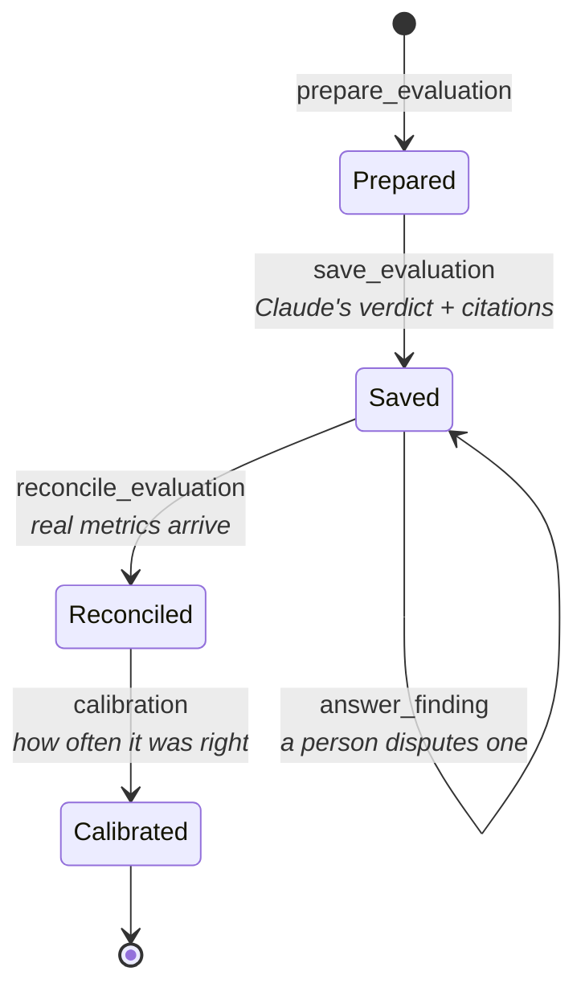
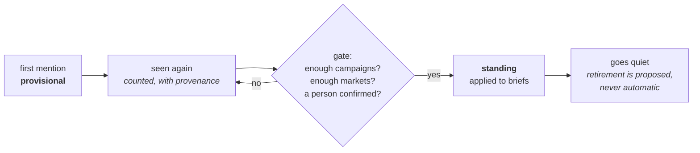
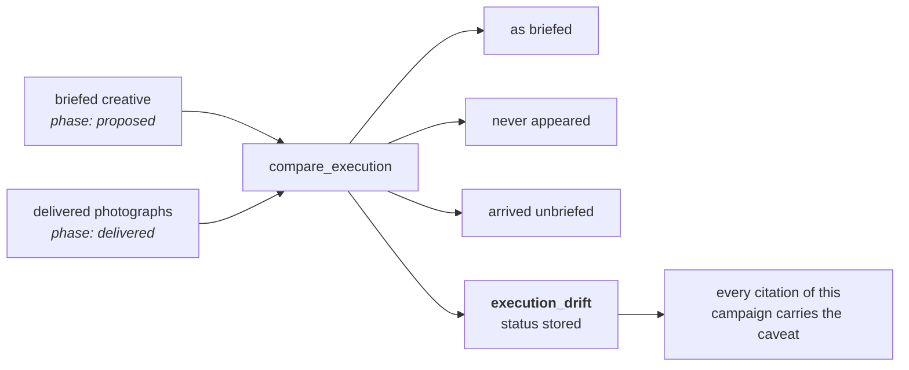
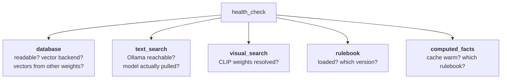
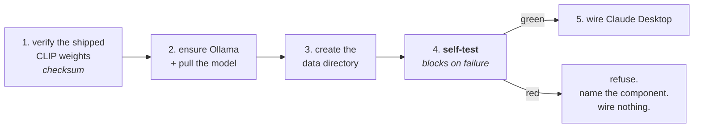

# Campaign Intelligence — Technical Design

> **Who this is for.** Somebody who has never seen this codebase and needs to understand what
> it is, how it is put together, and why it is put together that way. Read this first, then
> [`code-walkthrough.md`](code-walkthrough.md) for the module-by-module tour, and
> [`README.md`](README.md) to install and run it.

---

## 1. What the product is

A **marketing-campaign memory** that a marketer talks to through Claude.

An agency runs hundreds of campaigns. The decks, the results and the client's standing rules
live in a hundred places: someone's Drive, a wrap deck nobody reopened, a Slack message from
eight months ago. When a new brief arrives, the question *"have we done this before, and how
did it go?"* is answered from whoever happens to be in the room.

This product is the thing that remembers. You upload past campaigns, their creative and their
numbers. When a new proposal comes along, it hands Claude the most similar prior campaigns
**with their outcomes attached**, and Claude judges the proposal citing those specific priors.
After the campaign runs, you feed the real numbers back, and the judgment is reconciled against
what actually happened — so the next judgment knows how well the last one did.

### The loop

### The one design commitment everything else follows from

**Python owns the facts. Claude owns the judgment.**

The server never tries to be clever. It does not decide whether a campaign was good, whether
two rules mean the same thing, or whether a proposal is risky. It retrieves, counts, measures,
and hands Claude an evidence package. Claude reasons; the server records what Claude said and
what it rested on.

The corollary, and the thing that shapes almost every design decision in here: **the server
must never make a confident claim it cannot support.** A retrieval that returned nothing must
say so rather than return the best of nothing. A check that could not run must say "not
checked", never "passed". A number produced by an instrument that cannot measure the thing
must not be reported as a measurement.

---

## 2. `basis` — the spine of the whole design

Every claim this product emits carries a `basis` saying *what kind of claim it is*. This is
not decoration; it is the mechanism that keeps the previous paragraph true, and it is the first
thing to understand about the codebase.

| `basis` | Means | Example |
|---|---|---|
| `computed` | Arithmetic over stored records. Re-runnable, and the same every time. | "3 of 7 finished campaigns have results on file" |
| `judged` | A model decided. Carries a stamp of which model, which rulebook, which embedder. | A verdict on a proposal |
| `stated` | A person said so, and is named. | "R. Vega says this market will never have its numbers" |
| `heuristic` | A rule of thumb that is not a measurement, labelled so nobody mistakes it for one. | "these two client rules share wording" |

Two rules that follow, and are enforced by tests:

- **`unchecked` / `nothing_to_check` is never a pass.** If the commitment checker could not
  compare, the answer is "nothing is known about this, which is not the same as not finding
  it" — never a quiet absence of complaints.
- **A basis is never upgraded by moving data around.** A heuristic that gets stored does not
  become computed. This sounds obvious and is the defect the codebase has had to fix most often.

---

## 3. System shape

**Nothing in this diagram leaves the machine.** Ollama runs locally; the CLIP checkpoint ships
inside the installer. The only network calls the product makes are to `localhost:11434`
(Ollama) — and the installers' one-time download of Ollama itself.

### The two transports, and why both

| | stdio | Streamable HTTP |
|---|---|---|
| Used by | Claude Desktop (local) | Claude Web / cowork (custom connector) |
| Started by | the desktop app, per session | `campaign-intelligence serve` |
| Entry | `main.py stdio` | `http_app.py` → `/mcp` |
| Extras | — | `POST /upload` (large-file side channel), `GET /healthz` |

Both mount the *same* `mcp_server.py` tool surface. There is no second implementation of any
tool for the second transport — a rule the codebase enforces because two implementations of
one rule is its most frequently repeated defect.

---

## 4. Data model

28 SQLite tables. Grouped by what they are for:

| Group | Tables | What it holds |
|---|---|---|
| **Records** | `campaigns`, `campaign_chunks`, `assets`, `asset_fingerprints`, `import_batches` | the campaigns themselves, their deck text chunked for search, their images |
| **Outcomes** | `metrics`, `metric_values`, `metric_registry`, `measure_history` | what happened, typed and keyed |
| **Judgment** | `evaluations`, `reconciliations`, `retrievals`, `answers` | what Claude said, what it rested on, how it turned out |
| **Learning** | `corrections`, `correction_sightings`, `correction_scope`, `library_state` | client rules, each sighting, when each started applying where, and whether they have graduated |
| **Execution** | `commitments`, `execution_drift`, `drift_classifications` | what the brief promised vs what the photographs show |
| **Context** | `context_events`, `context_attributions` | what else was going on when a campaign ran |
| **People** | `authorship`, `erasures`, `reactions`, `feedback_notes` | who said what, and GDPR-shaped removal |
| **Machinery** | `vector_provenance`, `campaign_notices`, `write_refusals`, `write_order` | which model made each vector, what the product refused and why, and the one never-reused sequence that orders rows in different tables against each other |

### Vector spaces

Three, each filled by one model. `vectorstore.SPACES` is the single list; every coverage check
iterates it, so a space added in one place cannot be invisible to the checks.

| Space | Dim | Filled by | Holds |
|---|---|---|---|
| `campaign` | 768 | Ollama `nomic-embed-text` | deck text chunks |
| `asset` | 512 | CLIP ViT-B-32 | images |
| `commitment` | 512 | CLIP (text side) | promise phrases, so they can be compared against images |

Backed by **`sqlite-vec`** for real KNN, with a **pure-Python cosine fallback** when the
extension will not load. `health_check` reports which one is live, because the fallback is
correct but slower and that is a fact an operator should not have to discover from a stopwatch.

**Every vector records which model made it** (`vector_provenance`). Similarities from two
different models are not comparable, so ranking across them is arithmetic on incompatible
numbers — the product refuses to do it and says so instead.

---

## 5. Ingestion

Three things worth understanding here:

**Text is written before anything is embedded.** An earlier version did both in one loop and
broke out on failure, which left chunks holding the *old* deck's words with their `embedded`
flag still set. Two passes makes partial state honest: the words are always current, and the
index may be behind.

**One deadline for the whole tool call.** `TOOL_TIME_BUDGET_SECONDS` (default 45s) bounds the
*handler*, not each call inside it. When it runs out, the tool returns what it did, says what
is left, and `finish_indexing` closes the gap later. A half-finished upload is a designed
outcome, not a crash.

**Chunk indices are allocated per kind.** Body text and commentary each get their own
contiguous run, so a deck that grows does not interleave the client's remarks with its own
sections.

---

## 6. Retrieval and the evidence package

When Claude is asked to judge a proposal, `prepare_evaluation` builds a package:

The package deliberately includes **what is missing**. A judgment resting on zero verified
outcomes says so, in the same breath as the verdict — *"this rests on zero verified outcomes;
the Q2 results workbook would change that"*. That line is the product's answer to the failure
it was built against: a confident answer with nothing underneath it.

Every retrieval is recorded (`retrievals`) with its embedder and filters, so a judgment can be
traced back to exactly the evidence that produced it.

---

## 7. The judgment and reconciliation loop

- **`save_evaluation`** stores the verdict, its findings, and the records each finding cites.
  Quotes are **verified against the cited record** — a finding cannot attribute words to a deck
  that does not contain them.
- **`reconcile_evaluation`** compares the prediction to what happened.
- **`calibration`** reports how often judgments have been right — and refuses to report a
  figure "about whoever bothered": if judgments are reconciled selectively, that is stated.

---

## 8. Learning: measures and client rules on one mechanism

Two things accumulate: **metric keys** the agency actually uses, and **standing corrections**
the client keeps repeating. Both travel the same path, in `learning.py`, because they are the
same shape of event.

The gate needs **breadth**, not repetition: three mentions from one person copy-pasting is not
evidence, three markets independently saying the same thing is. And graduation always needs a
person — the product suggests, it never auto-merges. Whether two differently-worded rules are
*the same rule* is a judgment only somebody who knows the client's vocabulary can make, so it
is put to them in a queue rather than guessed.

> **Measured, and worth knowing:** the obvious automation here — embed the two rules, compare
> — does not work. Against the shipped embedder, pairs that *are* one rule score 0.646–0.972
> and pairs that are *not* score 0.763–0.963. A rule against its own opposite (*"logo top
> left"* / *"logo bottom right"*) scores 0.963, higher than most genuine pairs. The instrument
> measures topical and structural similarity; rule identity is neither. So the product does not
> do it, and says why.

---

## 9. Execution: what was briefed vs what ran

The third thing a campaign's result can mean — that **what ran was not what was briefed** —
is something most libraries cannot notice at all.

`commitments` goes finer: the specific promises a brief names ("seeding boxes two weeks before
launch") are extracted and each is looked for in the delivered photographs. Promises the
instrument *cannot* answer — anything about **how many** or **all** of something — are refused
out loud rather than answered wrongly, because for *"a single colourway"* four colourways in
frame would make the match **stronger**.

---

## 10. Gaps: what the library is missing

`gaps()` is the surface that says what is wrong with the library and what would fix it. Each
gap carries what it is, why it matters, how many records it affects, and **an offer** — a tool
call, prefilled, that the user can accept in one step.

An offer has to be one the tool accepts **and the record can use**. A gap whose only action
makes things worse is a complaint, and the codebase treats it as a defect.

| Gap | Fires when |
|---|---|
| `library_is_empty` | nothing to reason from yet |
| `few_verified_outcomes` | judgments rest on unmeasured precedent |
| `market_without_outcomes` | a whole market has never had its numbers |
| `partly_indexed` | records stored but not searchable |
| `execution_never_checked` | outcomes read as though the brief caused them, with nothing showing what ran |
| `no_window` | finished campaigns with no dates, so nothing can be checked against context |
| `judgments_never_reconciled` | the calibration figure is about whoever bothered |
| `commentary_never_read` | a deck's comments — often the most useful precedent — never read |

Gaps can be **set aside** with a reason and a name ("that agency no longer exists; the numbers
went with it"). A set-aside is a statement about the records somebody was looking at, so it
**reopens** when newer records arrive — the product does not agree to stop mentioning something
it has not yet seen.

---

## 11. Who said it

Every claim that came from a person carries who, when, and on whose behalf (`authorship`). This
matters for two reasons: a judgment citing a client rule has to be able to say *where the rule
came from*, and a person has the right to see and remove what the library holds about them
(`people.py`, `erasures`) — pseudonymisation, name correction, and a disclosure command that
says what is stored, where, and for how long.

---

## 12. Health, degradation and honesty about failure

The distinction that matters: **"not reachable" and "the model is not installed" are different
failures.** A running Ollama with nothing pulled answers on the socket and 404s every embed —
which is how text search can be dead while everything looks fine. The installers run this check
as a **gate**: a non-green result *refuses the install* and names the component, rather than
leaving it to be discovered three days later by a tool call that times out.

Degradation is always *reported*, never silent:

- sqlite-vec missing → Python fallback, said out loud
- CLIP weights missing → visual search unavailable, said out loud
- embedder down → "nothing is known about this", never "no matches found"

---

## 13. Packaging and runtime

| | |
|---|---|
| **Build** | PyInstaller one-folder bundle, per OS, in CI on a `v*` tag |
| **Ships with** | the 303MB fp16 CLIP checkpoint, so the product works air-gapped |
| **Linux** | `.tar.gz` + `install.sh` → `~/.local/share/campaign-intelligence` |
| **macOS** | `.pkg` (double-clickable) or `.tar.gz` + `install.sh` → `~/Library/Application Support/CampaignIntelligence` |
| **Windows** | Inno Setup `.exe` → `%LOCALAPPDATA%\Programs\CampaignIntelligence` |

All three installers do the same four things in the same order, and the order is load-bearing:

Step 5 comes **after** step 4 deliberately. Wiring first meant a refused install still left the
user's next Claude session pointing at the server the installer had just condemned.

On Unix the new copy is **staged** and only swapped in once the self-test passes, so a failed
upgrade leaves the working install untouched.

---

## 14. Design rules this codebase enforces on itself

These are worth knowing before you change anything, because the tests enforce them and the
review history is mostly about violating them:

1. **One implementation of one rule.** The most-repeated defect here is two copies of a rule
   that agree until one is edited. If you find yourself writing a second copy, extract instead.
2. **A test that cannot fail is not a test.** New logic is mutation-tested: break the
   implementation, confirm the test goes red. Several tests in this repo were found passing on
   *comments* rather than code.
3. **Measure before fixing.** More than once, measuring has overturned the premise of the
   change being made — including twice where the "fix" would have made the product worse.
4. **A false comment ranks with a false statement in code.** Docstrings claiming behaviour the
   code does not have are treated as defects.
5. **Say what was stored.** Silent normalisation is acceptable only if every write reports what
   it actually wrote, because a guess nobody hears about is one nobody can correct.

---

## 15. Where to go next

- [`code-walkthrough.md`](code-walkthrough.md) — every module, what it does, and where to look
- [`README.md`](README.md) — install, verify, run
- `docs/PRODUCT-REVIEW-PLAN.md` — the full phased history, item by item, with what each one
  found
- `docs/DEFERRALS.md` — every deferred decision, and why it was deferred or closed
